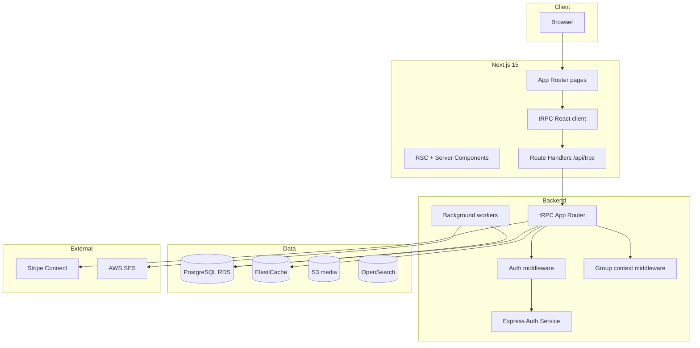

# Skool Clone — Implementation Plan

> **Product:** Multi-tenant community + membership + courses platform (Skool-style).  
> **Stack:** Next.js 15 (App Router) · tRPC · PostgreSQL · Redis · Express Auth (existing) · AWS (production).  
> **Tenancy:** Path-based groups at `/{group-slug}` (matches Skool’s `skool.com/{group}` model).

---

## Table of contents

1. [Architecture overview](#1-architecture-overview)
2. [tRPC design](#2-trpc-design)
3. [Complete page inventory](#3-complete-page-inventory)
4. [Next.js route tree](#4-nextjs-route-tree)
5. [Database entities (summary)](#5-database-entities-summary)
6. [Implementation phases](#6-implementation-phases)
7. [AWS scaling map](#7-aws-scaling-map)
8. [MVP vs v2 scope](#8-mvp-vs-v2-scope)
9. [Repo structure (FSD)](#9-repo-structure-fsd)

---

## 1. Architecture overview



### Service responsibilities

| Layer            | Responsibility                                                                              |
| ---------------- | ------------------------------------------------------------------------------------------- |
| **Next.js**      | UI, SSR/ISR, SEO (about pages), tRPC client, cookie/session bridge to Express Auth          |
| **tRPC**         | Type-safe API for all community/product features (groups, posts, courses, billing metadata) |
| **Express Auth** | Login, signup, JWT/session, password reset, OAuth — **no group business logic**             |
| **PostgreSQL**   | Source of truth; every group-owned row has `group_id`                                       |
| **Redis**        | Sessions cache, feed cache, rate limits, pub/sub for realtime (later)                       |
| **Workers**      | Email broadcasts, digests, analytics snapshots, Stripe webhook side effects                 |

### Auth flow with tRPC

1. User logs in via Express Auth → httpOnly cookie or JWT in cookie.
2. Next.js `createContext` reads session → `ctx.userId`.
3. Group-scoped procedures resolve `ctx.groupId` from URL slug + membership check.
4. Never trust `groupId` from client body alone — always derive from slug + membership.

---

## 2. tRPC design

### Packages (monorepo or shared package)

```
packages/
  api/                    # tRPC routers + context + procedures
    src/
      trpc.ts             # initTRPC, superjson transformer
      context.ts          # createContext (session, db, redis)
      routers/
        index.ts          # appRouter
        auth.ts           # bridge to Express (me, refresh) — thin
        group.ts
        membership.ts
        post.ts
        comment.ts
        category.ts
        course.ts
        lesson.ts
        event.ts
        gamification.ts
        billing.ts
        notification.ts
        chat.ts
        search.ts
        analytics.ts
        discovery.ts
        settings.ts
        plugin.ts
      middleware/
        isAuthed.ts
        isGroupMember.ts
        isGroupAdmin.ts
        isGroupOwner.ts
  db/                     # Drizzle or Prisma schema
  validators/             # Zod schemas shared client/server
```

### App router export

```typescript
// packages/api/src/routers/index.ts
export const appRouter = createTRPCRouter({
    auth: authRouter,
    group: groupRouter,
    membership: membershipRouter,
    post: postRouter,
    comment: commentRouter,
    category: categoryRouter,
    course: courseRouter,
    lesson: lessonRouter,
    event: eventRouter,
    gamification: gamificationRouter,
    billing: billingRouter,
    notification: notificationRouter,
    chat: chatRouter,
    search: searchRouter,
    analytics: analyticsRouter,
    discovery: discoveryRouter,
    settings: settingsRouter,
    plugin: pluginRouter,
});

export type AppRouter = typeof appRouter;
```

### Next.js integration

| File                           | Purpose                            |
| ------------------------------ | ---------------------------------- |
| `app/api/trpc/[trpc]/route.ts` | HTTP handler for tRPC              |
| `src/trpc/server.ts`           | `createCaller` for RSC             |
| `src/trpc/client.ts`           | React Query + tRPC client          |
| `src/trpc/provider.tsx`        | `TRPCReactProvider` in root layout |

### Procedure naming convention

| Pattern                         | Example                          |
| ------------------------------- | -------------------------------- |
| `group.getBySlug`               | Public group metadata            |
| `post.list`                     | Paginated feed (cursor)          |
| `post.create`                   | Member post (mutation)           |
| `course.getWithProgress`        | Classroom lesson + user progress |
| `billing.createCheckoutSession` | Stripe Checkout                  |
| `analytics.getDashboard`        | Admin MRR / retention            |

### Middleware stack

```
publicProcedure          → no auth
protectedProcedure       → ctx.userId required
groupMemberProcedure     → + valid membership in group
groupAdminProcedure        → + role admin | owner | billing_manager
groupOwnerProcedure        → + role owner | billing_manager
```

### Realtime (Phase 6+)

- tRPC subscriptions over WebSocket **or** separate WS service publishing to Redis.
- Start with polling + React Query `refetchInterval` for notifications; add subscriptions later.

---

## 3. Complete page inventory

Legend: **P0** = MVP · **P1** = v1 · **P2** = v2

### 3.1 Platform — marketing & legal

| #   | Route                | Page name                        | Access | Phase | tRPC procedures (primary)            |
| --- | -------------------- | -------------------------------- | ------ | ----- | ------------------------------------ |
| 1   | `/`                  | Platform home                    | Public | P0    | `discovery.featured`                 |
| 2   | `/features`          | Features marketing               | Public | P2    | —                                    |
| 3   | `/pricing`           | Platform pricing (creator plans) | Public | P1    | `billing.getPlatformPlans`           |
| 4   | `/about`             | Company about                    | Public | P2    | —                                    |
| 5   | `/discovery`         | Browse/search groups             | Public | P1    | `discovery.search`, `discovery.list` |
| 6   | `/legal`             | Terms of service                 | Public | P2    | —                                    |
| 7   | `/privacy`           | Privacy policy                   | Public | P2    | —                                    |
| 8   | `/contact`           | Contact                          | Public | P2    | —                                    |
| 9   | `/support`           | Support                          | Public | P2    | —                                    |
| 10  | `/careers`           | Careers                          | Public | P2    | —                                    |
| 11  | `/affiliate-program` | Platform affiliate info          | Public | P1    | `billing.getAffiliateInfo`           |
| 12  | `/refer`             | Referral landing                 | Public | P1    | `auth.trackReferral`                 |
| 13  | `/hormozi`           | Campaign landing (optional)      | Public | P2    | —                                    |

### 3.2 Platform — authentication

| #   | Route                     | Page name           | Access | Phase | Notes                                 |
| --- | ------------------------- | ------------------- | ------ | ----- | ------------------------------------- |
| 14  | `/login`                  | Login               | Public | P0    | Express Auth form; redirect to `/app` |
| 15  | `/signup`                 | Register            | Public | P0    | Express Auth                          |
| 16  | `/logout`                 | Logout              | Auth   | P0    | Clears session                        |
| 17  | `/reset-password`         | Request reset       | Public | P0    | Express Auth                          |
| 18  | `/change-password/[code]` | Confirm reset       | Public | P0    | Express Auth                          |
| 19  | `/account-onboarding`     | New user onboarding | Auth   | P1    | Profile setup via tRPC                |

### 3.3 Platform — authenticated global

| #   | Route                     | Page name                      | Access | Phase | tRPC procedures                              |
| --- | ------------------------- | ------------------------------ | ------ | ----- | -------------------------------------------- |
| 20  | `/app`                    | Dashboard / home redirect      | Auth   | P0    | `auth.me`, `group.listMine`                  |
| 21  | `/backpack`               | My groups list                 | Auth   | P0    | `group.listMine`                             |
| 22  | `/settings`               | User settings hub              | Auth   | P0    | `settings.getProfile`                        |
| 23  | `/settings/profile`       | Edit profile                   | Auth   | P0    | `settings.updateProfile`                     |
| 24  | `/settings/account`       | Email, password                | Auth   | P0    | Express Auth + `settings.updateAccount`      |
| 25  | `/settings/notifications` | Notification prefs             | Auth   | P1    | `settings.updateNotifications`               |
| 26  | `/settings/billing`       | User platform subscription     | Auth   | P1    | `billing.getUserSubscription`                |
| 27  | `/chats`                  | DM inbox                       | Auth   | P1    | `chat.listThreads`                           |
| 28  | `/chat`                   | Single DM (query: `?u=userId`) | Auth   | P1    | `chat.getThread`, `chat.sendMessage`         |
| 29  | `/notifications`          | Notification center            | Auth   | P1    | `notification.list`, `notification.markRead` |
| 30  | `/create`                 | Create new group wizard        | Auth   | P0    | `group.create`                               |
| 31  | `/live/[callId]`          | Live call room                 | Auth   | P2    | External/LiveKit integration                 |
| 32  | `/transactions/[id]`      | Transaction detail             | Auth   | P1    | `billing.getTransaction`                     |

### 3.4 Group — public (pre-join)

| #   | Route                   | Page name                   | Access      | Phase | tRPC procedures                               |
| --- | ----------------------- | --------------------------- | ----------- | ----- | --------------------------------------------- |
| 33  | `/{group}`              | Community feed              | Member      | P0    | `post.list`, `category.list`                  |
| 34  | `/{group}/about`        | Public landing / sales page | Public      | P0    | `group.getPublic`, `billing.getGroupPlans`    |
| 35  | `/{group}/about/charge` | Checkout                    | Public/Auth | P1    | `billing.createCheckoutSession`               |
| 36  | `/{group}/plans`        | Pricing tiers / upgrade     | Member      | P1    | `billing.getGroupPlans`, `billing.changePlan` |

### 3.5 Group — member core tabs

| #   | Route                           | Page name                 | Access | Phase | tRPC procedures                                   |
| --- | ------------------------------- | ------------------------- | ------ | ----- | ------------------------------------------------- |
| 37  | `/{group}`                      | Community feed (default)  | Member | P0    | `post.list`                                       |
| 38  | `/{group}?c={categoryId}`       | Feed filtered by category | Member | P0    | `post.list`                                       |
| 39  | `/{group}/{postId}`             | Single post + comments    | Member | P0    | `post.get`, `comment.list`, `comment.create`      |
| 40  | `/{group}/classroom`            | Course catalog            | Member | P0    | `course.list`                                     |
| 41  | `/{group}/classroom/{courseId}` | Course / lesson viewer    | Member | P0    | `course.get`, `lesson.get`, `lesson.markComplete` |
| 42  | `/{group}/calendar`             | Events calendar           | Member | P1    | `event.list`, `event.rsvp`                        |
| 43  | `/{group}/-/members`            | Member directory          | Member | P1    | `membership.listMembers`                          |
| 44  | `/{group}/-/map`                | Member map                | Member | P2    | `membership.listWithLocation`                     |
| 45  | `/{group}/-/leaderboards`       | Points leaderboard        | Member | P0    | `gamification.getLeaderboard`                     |
| 46  | `/{group}/-/search`             | Group search              | Member | P1    | `search.group`                                    |
| 47  | `/{group}/-/rules`              | Group rules               | Member | P0    | `group.getRules`                                  |

### 3.6 Group — admin & moderation

| #   | Route                           | Page name                     | Access        | Phase | tRPC procedures                                                      |
| --- | ------------------------------- | ----------------------------- | ------------- | ----- | -------------------------------------------------------------------- |
| 48  | `/{group}/-/pending`            | Approve/decline join requests | Admin         | P0    | `membership.listPending`, `membership.approve`, `membership.decline` |
| 49  | `/{group}/-/invited`            | Manage invites                | Admin         | P1    | `membership.listInvites`, `membership.createInvite`                  |
| 50  | `/{group}/-/reports`            | Moderation queue              | Admin         | P1    | `post.listReports`, `post.resolveReport`                             |
| 51  | `/{group}/-/disputes`           | Payment disputes              | Owner/Billing | P1    | `billing.listDisputes`                                               |
| 52  | `/{group}/-/performance`        | Analytics dashboard           | Admin         | P1    | `analytics.getDashboard`                                             |
| 53  | `/{group}/-/games`              | Skool Games leaderboard       | Admin         | P2    | `analytics.getGamesLeaderboard`                                      |
| 54  | `/{group}/-/merch`              | Merchandise                   | Admin         | P2    | —                                                                    |
| 55  | `/{group}/--/billing/connect`   | Stripe Connect onboarding     | Owner         | P1    | `billing.getConnectStatus`, `billing.createConnectLink`              |
| 56  | `/{group}/--/invoices/[number]` | Invoice detail                | Admin/Member  | P1    | `billing.getInvoice`                                                 |
| 57  | `/{group}/settings`             | Group settings hub (SPA)      | Admin         | P0    | Multiple routers — see §3.7                                          |

### 3.7 Group settings (single route, tab panels)

| Tab            | Features                                     | Phase | tRPC router                            |
| -------------- | -------------------------------------------- | ----- | -------------------------------------- |
| **General**    | Name, slug, logo, cover, description         | P0    | `group.update`, `settings.uploadMedia` |
| **About page** | Sales copy, images, video                    | P0    | `group.updateAbout`                    |
| **Tabs**       | Show/hide Community, Classroom, Calendar     | P0    | `settings.updateTabs`                  |
| **Community**  | Categories (max 10), default sort            | P0    | `category.*`                           |
| **Rules**      | Group rules text                             | P0    | `group.updateRules`                    |
| **Classroom**  | Course management entry                      | P0    | `course.*`                             |
| **Calendar**   | Event defaults                               | P1    | `event.*`                              |
| **Pricing**    | Free, sub, freemium, tiers, one-time, trial  | P1    | `billing.updateGroupPricing`           |
| **Plugins**    | Membership Qs, AutoDM, level unlocks, pixels | P1–P2 | `plugin.*`                             |
| **Discovery**  | Category, language, visibility               | P1    | `discovery.updateGroupMeta`            |
| **Admins**     | Roles: owner, billing, admin, mod            | P0    | `membership.updateRole`                |
| **Affiliates** | Member referral program                      | P2    | `billing.updateAffiliateSettings`      |
| **Links**      | External links sidebar                       | P1    | `settings.updateLinks`                 |
| **Billing**    | Payouts, fee display                         | P1    | `billing.*`                            |

### 3.8 Modals / overlays (not separate routes)

| UI                                | Trigger                 | Phase |
| --------------------------------- | ----------------------- | ----- |
| Post composer                     | Feed “New post”         | P0    |
| Comment thread drawer             | Post click              | P0    |
| Join group + membership questions | About “Join”            | P0    |
| Pin post                          | Admin on post           | P0    |
| Email broadcast confirm           | Admin on post           | P1    |
| Go Live                           | Admin calendar / header | P2    |
| Course editor drawer              | Classroom admin         | P0    |
| Member profile popover            | Click avatar            | P1    |
| Notification toast                | Realtime                | P1    |
| Upgrade plan modal                | Plans page              | P1    |

### 3.9 System pages

| Route          | Purpose            | Phase |
| -------------- | ------------------ | ----- |
| `/404`         | Not found          | P0    |
| `/maintenance` | Maintenance mode   | P1    |
| `/health`      | Health check (API) | P0    |

**Total: ~57 routed pages + settings tabs + modals**

---

## 4. Next.js route tree

Recommended App Router structure (optional `[locale]` prefix retained):

```
app/
  [locale]/
    (platform)/
      page.tsx                          # /
      features/page.tsx
      pricing/page.tsx
      discovery/page.tsx
      about/page.tsx
      legal/page.tsx
      privacy/page.tsx
      contact/page.tsx
      support/page.tsx
      affiliate-program/page.tsx
      refer/page.tsx
    (auth)/
      login/page.tsx
      signup/page.tsx
      logout/route.ts                   # POST redirect
      reset-password/page.tsx
      change-password/[code]/page.tsx
      account-onboarding/page.tsx
    (app)/
      app/page.tsx
      backpack/page.tsx
      settings/
        page.tsx
        profile/page.tsx
        account/page.tsx
        notifications/page.tsx
        billing/page.tsx
      chats/page.tsx
      chat/page.tsx
      notifications/page.tsx
      create/page.tsx
      live/[callId]/page.tsx
      transactions/[id]/page.tsx
    [group]/
      layout.tsx                        # Group shell + nav tabs
      page.tsx                          # Community feed
      about/
        page.tsx
        charge/page.tsx
      plans/page.tsx
      classroom/
        page.tsx
        [courseId]/page.tsx
      calendar/page.tsx
      [postId]/page.tsx
      (admin)/
        pending/page.tsx
        invited/page.tsx
        reports/page.tsx
        disputes/page.tsx
        performance/page.tsx
        games/page.tsx
        merch/page.tsx
        members/page.tsx                  # /-/members → rewrite or folder
        map/page.tsx
        leaderboards/page.tsx
        search/page.tsx
        rules/page.tsx
      settings/
        page.tsx                        # Tabbed admin settings
      billing/
        connect/page.tsx
        invoices/[number]/page.tsx
  api/
    trpc/[trpc]/route.ts
```

Use `middleware.ts` to resolve `group` slug and inject `x-group-slug` header for RSC.

---

## 5. Database entities (summary)

PostgreSQL with `group_id` on all tenant tables. Suggested ORM: **Drizzle** (lightweight, SQL-friendly) or Prisma.

### Core tables

| Table                  | Key columns                                                                            |
| ---------------------- | -------------------------------------------------------------------------------------- |
| `users`                | id, email, name, avatar_url (synced from Auth service)                                 |
| `groups`               | id, slug, name, description, logo_url, cover_url, owner_id, visibility, discovery_meta |
| `group_settings`       | group_id, tabs_config, rules, welcome_message, plugins_json                            |
| `group_memberships`    | group_id, user_id, role, status, tier_id, level, points, joined_at                     |
| `membership_tiers`     | group_id, name, price_cents, interval, benefits                                        |
| `membership_questions` | group_id, question, answer_type, order                                                 |
| `membership_answers`   | membership_id, question_id, answer                                                     |
| `categories`           | group_id, name, permissions, sort_mode                                                 |
| `posts`                | group_id, category_id, author_id, body, type, pinned, broadcast_email                  |
| `post_likes`           | post_id, user_id                                                                       |
| `comments`             | post_id, parent_id, author_id, body                                                    |
| `courses`              | group_id, title, access_type, level_unlock, tier_ids                                   |
| `course_folders`       | course_id, title, order                                                                |
| `lessons`              | course_id, folder_id, title, content_json, video_url, order, published                 |
| `lesson_progress`      | lesson_id, user_id, completed_at                                                       |
| `lesson_resources`     | lesson_id, type, url                                                                   |
| `events`               | group_id, title, starts_at, timezone, recurrence, access_type                          |
| `event_rsvps`          | event_id, user_id                                                                      |
| `notifications`        | user_id, type, payload, read_at                                                        |
| `chat_threads`         | id                                                                                     |
| `chat_messages`        | thread_id, sender_id, body                                                             |
| `subscriptions`        | group_id, user_id, stripe_subscription_id, status, tier_id                             |
| `invoices`             | stripe_invoice_id, group_id, user_id, amount, status                                   |
| `analytics_daily`      | group_id, date, members, mrr_cents, posts, engagement                                  |
| `affiliate_referrals`  | referrer_id, referred_user_id, group_id                                                |

### Level thresholds (match Skool)

| Level | Points required |
| ----- | --------------- |
| 1     | 0               |
| 2     | 5               |
| 3     | 20              |
| 4     | 65              |
| 5     | 155             |
| 6     | 515             |
| 7     | 2,015           |
| 8     | 8,015           |
| 9     | 33,015          |

---

## 6. Implementation phases

### Phase 0 — Foundation (Weeks 1–3)

**Goal:** tRPC wired, auth bridge, group shell, deploy baseline.

| Task                                                                                                 | Deliverable      |
| ---------------------------------------------------------------------------------------------------- | ---------------- |
| Add `@trpc/server`, `@trpc/client`, `@trpc/react-query`, `@tanstack/react-query`, `superjson`, `zod` | Dependencies     |
| Create `packages/api` with `appRouter`, context, `isAuthed` middleware                               | tRPC skeleton    |
| `app/api/trpc/[trpc]/route.ts` + `TRPCReactProvider`                                                 | Next integration |
| Express Auth session → `createContext` (`userId`)                                                    | Auth bridge      |
| Drizzle/Prisma + PostgreSQL Docker service                                                           | DB               |
| Tables: `users`, `groups`, `group_memberships`, `group_settings`                                     | Schema v1        |
| Middleware: resolve `group` from slug                                                                | Tenancy          |
| Pages: `/login`, `/signup`, `/app`, `/backpack`, `/create`, `/{group}/about`                         | P0 shell         |

**Exit criteria:** User can sign up, create a group, view public about page.

---

### Phase 1 — Community core (Weeks 4–8)

**Goal:** Full community loop.

| Feature               | Pages                     | tRPC                                     |
| --------------------- | ------------------------- | ---------------------------------------- |
| Community feed        | `/{group}`, `/{group}?c=` | `post.list`, `post.create`               |
| Single post           | `/{group}/[postId]`       | `post.get`, `comment.*`                  |
| Categories            | Settings tab              | `category.*`                             |
| Likes + points        | Feed                      | `post.like`, `gamification.addPoints`    |
| Roles                 | Settings → Admins         | `membership.updateRole`                  |
| Join flow + questions | About join modal          | `membership.requestJoin`                 |
| Pending approvals     | `/-/pending`              | `membership.approve/decline`             |
| Rules                 | `/-/rules`                | `group.getRules`                         |
| Pin / delete / report | Modals                    | `post.pin`, `post.delete`, `post.report` |

**Exit criteria:** Member joins, posts, comments, earns points, levels up.

---

### Phase 2 — Classroom (Weeks 9–12)

**Goal:** Courses inside groups.

| Feature                            | Pages                           | tRPC                             |
| ---------------------------------- | ------------------------------- | -------------------------------- |
| Course list                        | `/{group}/classroom`            | `course.list`                    |
| Course viewer                      | `/{group}/classroom/[courseId]` | `course.get`, `lesson.*`         |
| Admin course editor                | Settings / Classroom            | `course.create`, `lesson.update` |
| Folders + ordering                 | Editor                          | `course.reorder`                 |
| Progress tracking                  | Lesson viewer                   | `lesson.markComplete`            |
| Access: open, level, time, private | Course settings                 | `course.updateAccess`            |
| Resources + video embed            | Lesson                          | `lesson.addResource`             |
| Drip                               | Course settings                 | `course.updateDrip`              |

**Exit criteria:** Admin publishes course; member completes with progress bar.

---

### Phase 3 — Calendar & events (Weeks 13–15)

| Feature             | Pages               | tRPC                         |
| ------------------- | ------------------- | ---------------------------- |
| Event list/calendar | `/{group}/calendar` | `event.list`, `event.create` |
| RSVP                | Event detail        | `event.rsvp`                 |
| Email reminders     | Worker + SES        | `event.scheduleReminders`    |
| Permissions         | Event settings      | `event.updateAccess`         |
| Go Live v1          | Link external URL   | P2 native live               |

---

### Phase 4 — Gamification (Weeks 16–17)

| Feature                          | Pages             | tRPC                          |
| -------------------------------- | ----------------- | ----------------------------- |
| Points on like                   | Feed              | `gamification.onLike`         |
| Level calculation                | Profile badge     | `gamification.getLevel`       |
| Leaderboards                     | `/-/leaderboards` | `gamification.getLeaderboard` |
| Custom level names               | Settings          | `gamification.updateLevels`   |
| Level-gated courses/chat/posting | Plugins           | `plugin.update`               |

---

### Phase 5 — Payments (Weeks 18–22)

| Feature               | Pages                     | tRPC                                     |
| --------------------- | ------------------------- | ---------------------------------------- |
| Stripe Connect        | `/--/billing/connect`     | `billing.createConnectLink`              |
| Pricing models        | Settings → Pricing        | `billing.updateGroupPricing`             |
| Checkout              | `/about/charge`, `/plans` | `billing.createCheckoutSession`          |
| Webhooks              | API route                 | `billing.handleWebhook`                  |
| Member billing portal | Settings                  | `billing.getPortalUrl`                   |
| Refunds / disputes    | `/-/disputes`             | `billing.refund`, `billing.listDisputes` |
| MRR snapshot          | `/-/performance` (basic)  | `analytics.getMRR`                       |

**Exit criteria:** Paid group with subscription lifecycle working end-to-end.

---

### Phase 6 — Platform features (Weeks 23–28)

| Feature                          | Pages                | tRPC                        |
| -------------------------------- | -------------------- | --------------------------- |
| Discovery                        | `/discovery`         | `discovery.search`          |
| Group search                     | `/-/search`          | `search.group` (OpenSearch) |
| Chat / DMs                       | `/chats`, `/chat`    | `chat.*`                    |
| Notifications                    | `/notifications`     | `notification.*`            |
| Email broadcast                  | Post action          | `post.broadcastEmail`       |
| Members directory                | `/-/members`         | `membership.listMembers`    |
| Member map                       | `/-/map`             | `membership.updateLocation` |
| Full analytics                   | `/-/performance`     | `analytics.*`               |
| Plugins (AutoDM, pixels, Zapier) | Settings             | `plugin.*`                  |
| Affiliate                        | `/affiliate-program` | `billing.affiliate.*`       |

---

### Phase 7 — AWS production & scale (Weeks 29–36)

| Area              | Action                                                        |
| ----------------- | ------------------------------------------------------------- |
| **Compute**       | ECS Fargate: Next.js, tRPC API (can merge initially), Workers |
| **DB**            | RDS PostgreSQL Multi-AZ, connection pooling (PgBouncer)       |
| **Cache**         | ElastiCache Redis                                             |
| **CDN**           | CloudFront + S3 for media                                     |
| **Search**        | OpenSearch for `search.group`                                 |
| **Queue**         | SQS → worker (emails, analytics, webhooks)                    |
| **Email**         | SES                                                           |
| **CI/CD**         | GitHub Actions → ECR → ECS                                    |
| **Observability** | CloudWatch, structured logs, tRPC error tracking              |

**Performance patterns:**

- Feed: cursor pagination + Redis cache per `group_id`
- ISR: `/{group}/about` revalidate on settings update (`revalidateTag`)
- tRPC: `trpc.group.getPublic` cached at edge where safe
- Batch procedures: `trpc.createCaller` in RSC for parallel prefetch

---

## 7. AWS scaling map

| Component  | Dev (Docker Compose)                        | Production (AWS)       |
| ---------- | ------------------------------------------- | ---------------------- |
| Next.js    | `docker compose` dev profile                | ECS Fargate or Amplify |
| tRPC API   | Same container or `packages/api` standalone | ECS service behind ALB |
| PostgreSQL | Docker Postgres                             | RDS PostgreSQL         |
| Redis      | Docker Redis                                | ElastiCache            |
| Media      | Local / MinIO                               | S3 + CloudFront        |
| Email      | Mailhog                                     | SES                    |
| Search     | Postgres FTS                                | OpenSearch             |
| Auth       | Express container                           | ECS + same VPC         |
| Secrets    | `.env`                                      | Secrets Manager        |

---

## 8. MVP vs v2 scope

### MVP (≈12 weeks) — ship this first

- [ ] Auth: login, signup, settings profile
- [ ] Create group + about page
- [ ] Community feed (posts, comments, likes, categories)
- [ ] Join + pending approvals + membership questions
- [ ] Classroom (1+ courses, lessons, progress)
- [ ] Leaderboards + points
- [ ] Calendar (basic events)
- [ ] Stripe single paid tier
- [ ] Admin: categories, rules, members, basic settings

### v2 — after MVP

- Discovery marketplace + ranking
- Freemium + multiple tiers
- Chat / DMs + realtime
- Native live calls (LiveKit/Daily.co)
- Full analytics cohorts
- Zapier / webhooks
- Map, games, merch
- Platform affiliate program
- Email broadcasts + digests

---

## 9. Repo structure (FSD)

Align features with tRPC routers:

```
src/
  trpc/
    client.ts
    server.ts
    provider.tsx
  entities/
    group/
    post/
    course/
    membership/
  features/
    community-feed/
    post-composer/
    classroom/
    calendar/
    gamification/
    checkout/
    group-settings/
    join-group/
  widgets/
    GroupNav/
    GroupSidebar/
    PostCard/
    Leaderboard/
  pages/                    # optional; prefer app/ routes importing widgets

packages/
  api/                      # tRPC routers (or server/ if not monorepo)
  db/                       # schema + migrations
  validators/               # Zod
```

### Dependencies to add (Phase 0)

```bash
pnpm add @trpc/server @trpc/client @trpc/react-query @tanstack/react-query superjson zod
pnpm add drizzle-orm postgres  # or prisma @prisma/client
pnpm add -D drizzle-kit
```

---

## Appendix A — tRPC router checklist

| Router         | Key procedures                                                                          | Phase |
| -------------- | --------------------------------------------------------------------------------------- | ----- |
| `auth`         | `me`, `syncUser`                                                                        | 0     |
| `group`        | `create`, `getBySlug`, `getPublic`, `update`, `listMine`                                | 0–1   |
| `membership`   | `requestJoin`, `approve`, `decline`, `listMembers`, `listPending`, `updateRole`, `ban`  | 0–1   |
| `category`     | `list`, `create`, `update`, `delete`, `reorder`                                         | 1     |
| `post`         | `list`, `get`, `create`, `update`, `delete`, `like`, `pin`, `report`, `broadcastEmail`  | 1     |
| `comment`      | `list`, `create`, `delete`                                                              | 1     |
| `course`       | `list`, `get`, `create`, `update`, `delete`, `updateAccess`, `reorder`                  | 2     |
| `lesson`       | `get`, `create`, `update`, `markComplete`, `addResource`                                | 2     |
| `event`        | `list`, `get`, `create`, `update`, `rsvp`, `delete`                                     | 3     |
| `gamification` | `getLeaderboard`, `getLevel`, `onLike`, `updateLevels`                                  | 4     |
| `billing`      | `createCheckoutSession`, `createConnectLink`, `handleWebhook`, `getPortalUrl`, `refund` | 5     |
| `analytics`    | `getDashboard`, `getMRR`, `getCohorts`                                                  | 5–6   |
| `notification` | `list`, `markRead`, `getPreferences`                                                    | 6     |
| `chat`         | `listThreads`, `getThread`, `sendMessage`                                               | 6     |
| `search`       | `group`, `discovery`                                                                    | 6     |
| `discovery`    | `list`, `search`, `updateGroupMeta`                                                     | 6     |
| `settings`     | `getProfile`, `updateProfile`, `updateTabs`, `updateLinks`, `uploadMedia`               | 0–6   |
| `plugin`       | `list`, `update`                                                                        | 6     |

---

## Appendix B — Express Auth ↔ tRPC contract

| Concern                                       | Owner                                              |
| --------------------------------------------- | -------------------------------------------------- |
| Login, signup, password reset                 | Express Auth                                       |
| JWT / session cookie                          | Express Auth                                       |
| `userId` in tRPC context                      | Next.js reads cookie → validates with Auth service |
| Group roles, membership                       | tRPC + PostgreSQL only                             |
| Stripe customer for **member paying group**   | tRPC `billing` + Stripe                            |
| Stripe customer for **creator platform plan** | tRPC `billing` (platform account)                  |

---

## Appendix C — Legal note

This plan documents **feature parity** for a community platform inspired by Skool’s public product. Use original branding, copy, and UI design. Do not copy Skool trademarks or proprietary assets.

---

_Last updated: 2026-05-31_
