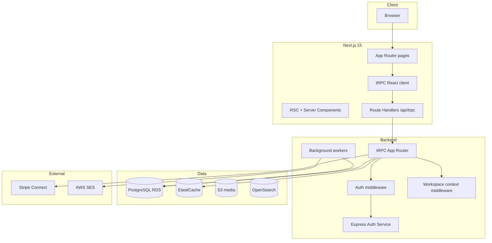
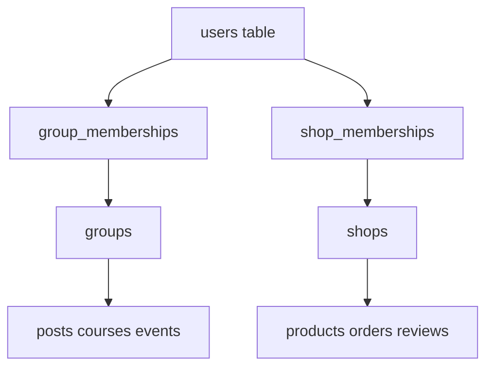

# Platform Plan — Communities + Ecommerce

> **Product:** Multi-tenant platform where creators choose a **community** (Skool-style) or an **online store** (ecommerce, see `demo_project/`). Both modes share auth, billing primitives, and the same monorepo.  
> **Stack:** Next.js 15 (App Router) · tRPC · PostgreSQL · Prisma · Redis · Express Auth · AWS (production).  
> **Tenancy:** Path-based workspaces — communities at `/{group-slug}`, shops at `/s/{shop-slug}` (subdomain optional in v2, see Phase Ecommerce).

---

## Table of contents

1. [Architecture overview](#1-architecture-overview)
2. [tRPC design](#2-trpc-design)
3. [Complete page inventory](#3-complete-page-inventory)
4. [Next.js route tree](#4-nextjs-route-tree)
5. [Database entities (summary)](#5-database-entities-summary)
6. [Implementation phases](#6-implementation-phases)
7. [AWS scaling map](#7-aws-scaling-map)
8. [MVP vs v2 scope](#8-mvp-vs-v2-scope)
9. [Repo structure (FSD)](#9-repo-structure-fsd)
10. [Dual workspace model (community vs shop)](#10-dual-workspace-model-community-vs-shop)
11. [Phase Ecommerce](#11-phase-ecommerce)

---

## 1. Architecture overview



### Service responsibilities

| Layer            | Responsibility                                                                        |
| ---------------- | ------------------------------------------------------------------------------------- |
| **Next.js**      | UI, SSR/ISR, SEO (about pages), tRPC client, cookie/session bridge to Express Auth    |
| **tRPC**         | Type-safe API for community **and** shop features (groups, posts, products, checkout) |
| **Express Auth** | Login, signup, JWT/session, password reset, OAuth — **no workspace business logic**   |
| **PostgreSQL**   | Source of truth; group-owned rows have `group_id`, shop-owned rows have `shop_id`     |
| **Redis**        | Sessions cache, feed cache, rate limits, pub/sub for realtime (later)                 |
| **Workers**      | Email broadcasts, digests, analytics snapshots, Stripe webhook side effects           |

### Auth flow with tRPC

1. User logs in via Express Auth → httpOnly cookie or JWT in cookie.
2. Next.js `createContext` reads session → `ctx.userId`.
3. Group-scoped **or** shop-scoped procedures resolve `ctx.groupId` / `ctx.shopId` from URL slug + membership check.
4. Never trust `groupId` / `shopId` from client body alone — always derive from slug + membership.

See [§10 Dual workspace model](#10-dual-workspace-model-community-vs-shop) for how communities and shops coexist.

---

## 2. tRPC design

### Packages (monorepo or shared package)

```
packages/
  api/                    # tRPC routers + context + procedures
    src/
      trpc.ts             # initTRPC, superjson transformer
      context.ts          # createContext (session, db, redis)
      routers/
        index.ts          # appRouter
        auth.ts           # bridge to Express (me, refresh) — thin
        group.ts
        membership.ts
        post.ts
        comment.ts
        category.ts
        course.ts
        lesson.ts
        event.ts
        gamification.ts
        billing.ts
        notification.ts
        chat.ts
        search.ts
        analytics.ts
        discovery.ts
        settings.ts
        plugin.ts
        shop.ts
        shopMembership.ts
        catalog.ts
        cart.ts
        checkout.ts
        order.ts
        review.ts
      middleware/
        isAuthed.ts
        isGroupMember.ts
        isGroupAdmin.ts
        isGroupOwner.ts
        isShopMember.ts
        isShopAdmin.ts
        isShopOwner.ts
  db/                     # Drizzle or Prisma schema
  validators/             # Zod schemas shared client/server
```

### App router export

```typescript
// packages/api/src/routers/index.ts
export const appRouter = createTRPCRouter({
    auth: authRouter,
    group: groupRouter,
    membership: membershipRouter,
    post: postRouter,
    comment: commentRouter,
    category: categoryRouter,
    course: courseRouter,
    lesson: lessonRouter,
    event: eventRouter,
    gamification: gamificationRouter,
    billing: billingRouter,
    notification: notificationRouter,
    chat: chatRouter,
    search: searchRouter,
    analytics: analyticsRouter,
    discovery: discoveryRouter,
    settings: settingsRouter,
    plugin: pluginRouter,
    shop: shopRouter,
    shopMembership: shopMembershipRouter,
    catalog: catalogRouter,
    cart: cartRouter,
    checkout: checkoutRouter,
    order: orderRouter,
    review: reviewRouter,
});

export type AppRouter = typeof appRouter;
```

### Next.js integration

| File                           | Purpose                            |
| ------------------------------ | ---------------------------------- |
| `app/api/trpc/[trpc]/route.ts` | HTTP handler for tRPC              |
| `src/trpc/server.ts`           | `createCaller` for RSC             |
| `src/trpc/client.ts`           | React Query + tRPC client          |
| `src/trpc/provider.tsx`        | `TRPCReactProvider` in root layout |

### Procedure naming convention

| Pattern                         | Example                          |
| ------------------------------- | -------------------------------- |
| `group.getBySlug`               | Public group metadata            |
| `post.list`                     | Paginated feed (cursor)          |
| `post.create`                   | Member post (mutation)           |
| `course.getWithProgress`        | Classroom lesson + user progress |
| `billing.createCheckoutSession` | Stripe Checkout                  |
| `analytics.getDashboard`        | Admin MRR / retention            |

### Middleware stack

```
publicProcedure          → no auth
protectedProcedure       → ctx.userId required
groupMemberProcedure     → + valid membership in group
groupAdminProcedure      → + role admin | owner | billing_manager
groupOwnerProcedure      → + role owner | billing_manager
shopMemberProcedure      → + valid membership in shop (customer or staff)
shopAdminProcedure       → + role admin | owner
shopOwnerProcedure       → + role owner
```

### Realtime (Phase 6+)

- tRPC subscriptions over WebSocket **or** separate WS service publishing to Redis.
- Start with polling + React Query `refetchInterval` for notifications; add subscriptions later.

---

## 3. Complete page inventory

Legend: **P0** = MVP · **P1** = v1 · **P2** = v2

### 3.1 Platform — marketing & legal

| #   | Route                | Page name                        | Access | Phase | tRPC procedures (primary)            |
| --- | -------------------- | -------------------------------- | ------ | ----- | ------------------------------------ |
| 1   | `/`                  | Platform home                    | Public | P0    | `discovery.featured`                 |
| 2   | `/features`          | Features marketing               | Public | P2    | —                                    |
| 3   | `/pricing`           | Platform pricing (creator plans) | Public | P1    | `billing.getPlatformPlans`           |
| 4   | `/about`             | Company about                    | Public | P2    | —                                    |
| 5   | `/discovery`         | Browse/search groups             | Public | P1    | `discovery.search`, `discovery.list` |
| 6   | `/legal`             | Terms of service                 | Public | P2    | —                                    |
| 7   | `/privacy`           | Privacy policy                   | Public | P2    | —                                    |
| 8   | `/contact`           | Contact                          | Public | P2    | —                                    |
| 9   | `/support`           | Support                          | Public | P2    | —                                    |
| 10  | `/careers`           | Careers                          | Public | P2    | —                                    |
| 11  | `/affiliate-program` | Platform affiliate info          | Public | P1    | `billing.getAffiliateInfo`           |
| 12  | `/refer`             | Referral landing                 | Public | P1    | `auth.trackReferral`                 |
| 13  | `/hormozi`           | Campaign landing (optional)      | Public | P2    | —                                    |

### 3.2 Platform — authentication

| #   | Route                     | Page name           | Access | Phase | Notes                                 |
| --- | ------------------------- | ------------------- | ------ | ----- | ------------------------------------- |
| 14  | `/login`                  | Login               | Public | P0    | Express Auth form; redirect to `/app` |
| 15  | `/signup`                 | Register            | Public | P0    | Express Auth                          |
| 16  | `/logout`                 | Logout              | Auth   | P0    | Clears session                        |
| 17  | `/reset-password`         | Request reset       | Public | P0    | Express Auth                          |
| 18  | `/change-password/[code]` | Confirm reset       | Public | P0    | Express Auth                          |
| 19  | `/account-onboarding`     | New user onboarding | Auth   | P1    | Profile setup via tRPC                |

### 3.3 Platform — authenticated global

| #   | Route                     | Page name                      | Access | Phase | tRPC procedures                                   |
| --- | ------------------------- | ------------------------------ | ------ | ----- | ------------------------------------------------- |
| 20  | `/app`                    | Dashboard / home redirect      | Auth   | P0    | `auth.me`, `group.listMine`                       |
| 21  | `/backpack`               | My groups list                 | Auth   | P0    | `group.listMine`                                  |
| 22  | `/settings`               | User settings hub              | Auth   | P0    | `settings.getProfile`                             |
| 23  | `/settings/profile`       | Edit profile                   | Auth   | P0    | `settings.updateProfile`                          |
| 24  | `/settings/account`       | Email, password                | Auth   | P0    | Express Auth + `settings.updateAccount`           |
| 25  | `/settings/notifications` | Notification prefs             | Auth   | P1    | `settings.updateNotifications`                    |
| 26  | `/settings/billing`       | User platform subscription     | Auth   | P1    | `billing.getUserSubscription`                     |
| 27  | `/chats`                  | DM inbox                       | Auth   | P1    | `chat.listThreads`                                |
| 28  | `/chat`                   | Single DM (query: `?u=userId`) | Auth   | P1    | `chat.getThread`, `chat.sendMessage`              |
| 29  | `/notifications`          | Notification center            | Auth   | P1    | `notification.list`, `notification.markRead`      |
| 30  | `/create`                 | Create workspace wizard        | Auth   | P0    | `group.create` **or** `shop.create` (type picker) |
| 31  | `/live/[callId]`          | Live call room                 | Auth   | P2    | External/LiveKit integration                      |
| 32  | `/transactions/[id]`      | Transaction detail             | Auth   | P1    | `billing.getTransaction`                          |
| 33  | `/my-shops`               | My stores list                 | Auth   | E1    | `shop.listMine`                                   |

### 3.4 Group — public (pre-join)

| #   | Route                   | Page name                   | Access      | Phase | tRPC procedures                               |
| --- | ----------------------- | --------------------------- | ----------- | ----- | --------------------------------------------- |
| 33  | `/{group}`              | Community feed              | Member      | P0    | `post.list`, `category.list`                  |
| 34  | `/{group}/about`        | Public landing / sales page | Public      | P0    | `group.getPublic`, `billing.getGroupPlans`    |
| 35  | `/{group}/about/charge` | Checkout                    | Public/Auth | P1    | `billing.createCheckoutSession`               |
| 36  | `/{group}/plans`        | Pricing tiers / upgrade     | Member      | P1    | `billing.getGroupPlans`, `billing.changePlan` |

### 3.5 Group — member core tabs

| #   | Route                           | Page name                 | Access | Phase | tRPC procedures                                   |
| --- | ------------------------------- | ------------------------- | ------ | ----- | ------------------------------------------------- |
| 37  | `/{group}`                      | Community feed (default)  | Member | P0    | `post.list`                                       |
| 38  | `/{group}?c={categoryId}`       | Feed filtered by category | Member | P0    | `post.list`                                       |
| 39  | `/{group}/{postId}`             | Single post + comments    | Member | P0    | `post.get`, `comment.list`, `comment.create`      |
| 40  | `/{group}/classroom`            | Course catalog            | Member | P0    | `course.list`                                     |
| 41  | `/{group}/classroom/{courseId}` | Course / lesson viewer    | Member | P0    | `course.get`, `lesson.get`, `lesson.markComplete` |
| 42  | `/{group}/calendar`             | Events calendar           | Member | P1    | `event.list`, `event.rsvp`                        |
| 43  | `/{group}/-/members`            | Member directory          | Member | P1    | `membership.listMembers`                          |
| 44  | `/{group}/-/map`                | Member map                | Member | P2    | `membership.listWithLocation`                     |
| 45  | `/{group}/-/leaderboards`       | Points leaderboard        | Member | P0    | `gamification.getLeaderboard`                     |
| 46  | `/{group}/-/search`             | Group search              | Member | P1    | `search.group`                                    |
| 47  | `/{group}/-/rules`              | Group rules               | Member | P0    | `group.getRules`                                  |

### 3.6 Group — admin & moderation

| #   | Route                           | Page name                     | Access        | Phase | tRPC procedures                                                      |
| --- | ------------------------------- | ----------------------------- | ------------- | ----- | -------------------------------------------------------------------- |
| 48  | `/{group}/-/pending`            | Approve/decline join requests | Admin         | P0    | `membership.listPending`, `membership.approve`, `membership.decline` |
| 49  | `/{group}/-/invited`            | Manage invites                | Admin         | P1    | `membership.listInvites`, `membership.createInvite`                  |
| 50  | `/{group}/-/reports`            | Moderation queue              | Admin         | P1    | `post.listReports`, `post.resolveReport`                             |
| 51  | `/{group}/-/disputes`           | Payment disputes              | Owner/Billing | P1    | `billing.listDisputes`                                               |
| 52  | `/{group}/-/performance`        | Analytics dashboard           | Admin         | P1    | `analytics.getDashboard`                                             |
| 53  | `/{group}/-/games`              | Skool Games leaderboard       | Admin         | P2    | `analytics.getGamesLeaderboard`                                      |
| 54  | `/{group}/-/merch`              | Merchandise                   | Admin         | P2    | —                                                                    |
| 55  | `/{group}/--/billing/connect`   | Stripe Connect onboarding     | Owner         | P1    | `billing.getConnectStatus`, `billing.createConnectLink`              |
| 56  | `/{group}/--/invoices/[number]` | Invoice detail                | Admin/Member  | P1    | `billing.getInvoice`                                                 |
| 57  | `/{group}/settings`             | Group settings hub (SPA)      | Admin         | P0    | Multiple routers — see §3.7                                          |

### 3.7 Group settings (single route, tab panels)

| Tab            | Features                                     | Phase | tRPC router                            |
| -------------- | -------------------------------------------- | ----- | -------------------------------------- |
| **General**    | Name, slug, logo, cover, description         | P0    | `group.update`, `settings.uploadMedia` |
| **About page** | Sales copy, images, video                    | P0    | `group.updateAbout`                    |
| **Tabs**       | Show/hide Community, Classroom, Calendar     | P0    | `settings.updateTabs`                  |
| **Community**  | Categories (max 10), default sort            | P0    | `category.*`                           |
| **Rules**      | Group rules text                             | P0    | `group.updateRules`                    |
| **Classroom**  | Course management entry                      | P0    | `course.*`                             |
| **Calendar**   | Event defaults                               | P1    | `event.*`                              |
| **Pricing**    | Free, sub, freemium, tiers, one-time, trial  | P1    | `billing.updateGroupPricing`           |
| **Plugins**    | Membership Qs, AutoDM, level unlocks, pixels | P1–P2 | `plugin.*`                             |
| **Discovery**  | Category, language, visibility               | P1    | `discovery.updateGroupMeta`            |
| **Admins**     | Roles: owner, billing, admin, mod            | P0    | `membership.updateRole`                |
| **Affiliates** | Member referral program                      | P2    | `billing.updateAffiliateSettings`      |
| **Links**      | External links sidebar                       | P1    | `settings.updateLinks`                 |
| **Billing**    | Payouts, fee display                         | P1    | `billing.*`                            |

### 3.8 Modals / overlays (not separate routes)

| UI                                | Trigger                 | Phase |
| --------------------------------- | ----------------------- | ----- |
| Post composer                     | Feed “New post”         | P0    |
| Comment thread drawer             | Post click              | P0    |
| Join group + membership questions | About “Join”            | P0    |
| Pin post                          | Admin on post           | P0    |
| Email broadcast confirm           | Admin on post           | P1    |
| Go Live                           | Admin calendar / header | P2    |
| Course editor drawer              | Classroom admin         | P0    |
| Member profile popover            | Click avatar            | P1    |
| Notification toast                | Realtime                | P1    |
| Upgrade plan modal                | Plans page              | P1    |

### 3.9 System pages

| Route          | Purpose            | Phase |
| -------------- | ------------------ | ----- |
| `/404`         | Not found          | P0    |
| `/maintenance` | Maintenance mode   | P1    |
| `/health`      | Health check (API) | P0    |

**Total: ~57 community routed pages + shop pages (§3.10) + settings tabs + modals**

### 3.10 Shop — public storefront (ecommerce · Phase Ecommerce)

Legend: **E0** = shop MVP shell · **E1** = catalog + cart · **E2** = checkout + orders

| #   | Route                        | Page name              | Access      | Phase | tRPC procedures (primary)                   |
| --- | ---------------------------- | ---------------------- | ----------- | ----- | ------------------------------------------- |
| 58  | `/s/{shop}`                  | Store home / catalog   | Public      | E1    | `catalog.listProducts`, `shop.getPublic`    |
| 59  | `/s/{shop}/[category]`       | Category listing       | Public      | E1    | `catalog.listByCategory`                    |
| 60  | `/s/{shop}/[category]/[sub]` | Subcategory listing    | Public      | E1    | `catalog.listByCategory`                    |
| 61  | `/s/{shop}/products/[id]`    | Product detail         | Public      | E1    | `catalog.getProduct`, `review.list`         |
| 62  | `/s/{shop}/cart`             | Shopping cart          | Public/Auth | E1    | `cart.get`, `cart.updateItem`               |
| 63  | `/s/{shop}/checkout`         | Checkout               | Auth        | E2    | `checkout.getProducts`, `checkout.purchase` |
| 64  | `/s/{shop}/checkout/success` | Order confirmation     | Auth        | E2    | `order.getBySession`                        |
| 65  | `/s/{shop}/library`          | Purchased products     | Auth        | E2    | `order.listLibrary`                         |
| 66  | `/s/{shop}/library/[id]`     | Purchased product view | Auth        | E2    | `order.getLibraryItem`, `review.*`          |

### 3.11 Shop — seller admin

| #   | Route                        | Page name                 | Access | Phase | tRPC procedures                               |
| --- | ---------------------------- | ------------------------- | ------ | ----- | --------------------------------------------- |
| 67  | `/s/{shop}/admin`            | Shop dashboard            | Admin  | E1    | `shop.getDashboard`                           |
| 68  | `/s/{shop}/admin/products`   | Product list              | Admin  | E1    | `catalog.list`, `catalog.create`              |
| 69  | `/s/{shop}/admin/orders`     | Orders                    | Admin  | E2    | `order.list`, `order.get`                     |
| 70  | `/s/{shop}/admin/categories` | Categories                | Admin  | E1    | `catalog.*Category`                           |
| 71  | `/s/{shop}/admin/tags`       | Tags                      | E1     | E1    | `catalog.*Tag`                                |
| 72  | `/s/{shop}/admin/settings`   | Shop settings (SPA tabs)  | Admin  | E1    | `shop.update`, `settings.uploadMedia`         |
| 73  | `/s/{shop}/admin/stripe`     | Stripe Connect onboarding | Owner  | E2    | `billing.getConnectStatus`, `checkout.verify` |

### 3.12 Shop modals / overlays

| UI              | Trigger              | Phase |
| --------------- | -------------------- | ----- |
| Add to cart     | Product card / PDP   | E1    |
| Cart drawer     | Header cart icon     | E1    |
| Review form     | Library product view | E2    |
| Archive product | Admin product row    | E1    |

---

## 4. Next.js route tree

Recommended App Router structure (optional `[locale]` prefix retained):

```
app/
  [locale]/
    (platform)/
      page.tsx                          # /
      features/page.tsx
      pricing/page.tsx
      discovery/page.tsx
      about/page.tsx
      legal/page.tsx
      privacy/page.tsx
      contact/page.tsx
      support/page.tsx
      affiliate-program/page.tsx
      refer/page.tsx
    (auth)/
      login/page.tsx
      signup/page.tsx
      logout/route.ts                   # POST redirect
      reset-password/page.tsx
      change-password/[code]/page.tsx
      account-onboarding/page.tsx
    (app)/
      app/page.tsx
      backpack/page.tsx
      settings/
        page.tsx
        profile/page.tsx
        account/page.tsx
        notifications/page.tsx
        billing/page.tsx
      chats/page.tsx
      chat/page.tsx
      notifications/page.tsx
      create/page.tsx                     # Workspace type picker → group | shop wizard
      my-shops/page.tsx
      live/[callId]/page.tsx
      transactions/[id]/page.tsx
    [group]/
      layout.tsx                        # Group shell + nav tabs
      page.tsx                          # Community feed
      about/
        page.tsx
        charge/page.tsx
      plans/page.tsx
      classroom/
        page.tsx
        [courseId]/page.tsx
      calendar/page.tsx
      [postId]/page.tsx
      (admin)/
        pending/page.tsx
        invited/page.tsx
        reports/page.tsx
        disputes/page.tsx
        performance/page.tsx
        games/page.tsx
        merch/page.tsx
        members/page.tsx                  # /-/members → rewrite or folder
        map/page.tsx
        leaderboards/page.tsx
        search/page.tsx
        rules/page.tsx
      settings/
        page.tsx                        # Tabbed admin settings
      billing/
        connect/page.tsx
        invoices/[number]/page.tsx
    s/
      [shop]/
        layout.tsx                      # Storefront shell (navbar, cart)
        page.tsx                        # Catalog home
        [category]/
          page.tsx
          [subcategory]/page.tsx
        products/
          [productId]/page.tsx
        cart/page.tsx
        checkout/
          page.tsx
          success/page.tsx
        library/
          page.tsx
          [productId]/page.tsx
        admin/
          page.tsx
          products/page.tsx
          orders/page.tsx
          categories/page.tsx
          tags/page.tsx
          settings/page.tsx
          stripe/page.tsx
  api/
    trpc/[trpc]/route.ts
    stripe/webhooks/route.ts            # Shared Stripe webhooks (groups + shops)
```

Use `middleware.ts` to resolve workspace slug and inject headers for RSC:

- `/{locale}/{group-slug}` → `x-group-slug` (reserved path segments exclude `s`, `app`, `login`, …)
- `/{locale}/s/{shop-slug}` → `x-shop-slug`

Optional v2: subdomain routing for shops (`{shop}.yourdomain.com`) — see [§11 Phase Ecommerce](#11-phase-ecommerce) and `demo_project/src/middleware.ts`.

---

## 5. Database entities (summary)

PostgreSQL with `group_id` on community tables and `shop_id` on ecommerce tables. ORM: **Prisma** (current repo).

### Core tables — platform & auth

| Table   | Key columns                                                                            |
| ------- | -------------------------------------------------------------------------------------- |
| `users` | id, email, username, name, avatar_url, roles, auth security fields (see Prisma schema) |

### Core tables — community (Skool)

| Table                  | Key columns                                                                            |
| ---------------------- | -------------------------------------------------------------------------------------- |
| `groups`               | id, slug, name, description, logo_url, cover_url, owner_id, visibility, discovery_meta |
| `group_settings`       | group_id, tabs_config, rules, welcome_message, plugins_json                            |
| `group_memberships`    | group_id, user_id, role, status, tier_id, level, points, joined_at                     |
| `membership_tiers`     | group_id, name, price_cents, interval, benefits                                        |
| `membership_questions` | group_id, question, answer_type, order                                                 |
| `membership_answers`   | membership_id, question_id, answer                                                     |
| `categories`           | group_id, name, permissions, sort_mode                                                 |
| `posts`                | group_id, category_id, author_id, body, type, pinned, broadcast_email                  |
| `post_likes`           | post_id, user_id                                                                       |
| `comments`             | post_id, parent_id, author_id, body                                                    |
| `courses`              | group_id, title, access_type, level_unlock, tier_ids                                   |
| `course_folders`       | course_id, title, order                                                                |
| `lessons`              | course_id, folder_id, title, content_json, video_url, order, published                 |
| `lesson_progress`      | lesson_id, user_id, completed_at                                                       |
| `lesson_resources`     | lesson_id, type, url                                                                   |
| `events`               | group_id, title, starts_at, timezone, recurrence, access_type                          |
| `event_rsvps`          | event_id, user_id                                                                      |
| `notifications`        | user_id, type, payload, read_at                                                        |
| `chat_threads`         | id                                                                                     |
| `chat_messages`        | thread_id, sender_id, body                                                             |
| `subscriptions`        | group_id, user_id, stripe_subscription_id, status, tier_id                             |
| `invoices`             | stripe_invoice_id, group_id, user_id, amount, status                                   |
| `analytics_daily`      | group_id, date, members, mrr_cents, posts, engagement                                  |
| `affiliate_referrals`  | referrer_id, referred_user_id, group_id                                                |

### Core tables — ecommerce (shop · Phase Ecommerce)

Mapped from `demo_project/` Payload collections → Prisma models.

| Table                | Key columns                                                                                             | demo_project reference   |
| -------------------- | ------------------------------------------------------------------------------------------------------- | ------------------------ |
| `shops`              | id, slug, name, image_url, stripe_account_id, stripe_details_submitted, owner_id                        | `tenants`                |
| `shop_memberships`   | shop_id, user_id, role (`owner` \| `admin` \| `staff` \| `customer`), status                            | `users.tenants[]` plugin |
| `shop_settings`      | shop_id, currency, checkout_config_json                                                                 | tenant fields            |
| `product_categories` | shop_id, name, slug, parent_id, sort_order                                                              | `categories`             |
| `tags`               | shop_id, name                                                                                           | `tags`                   |
| `products`           | shop_id, name, description, price_cents, image_urls, category_id, content_json, is_private, is_archived | `products`               |
| `product_tags`       | product_id, tag_id                                                                                      | M2M on `tags`            |
| `orders`             | shop_id, user_id, product_id, stripe_checkout_session_id, stripe_account_id, amount_cents, status       | `orders`                 |
| `reviews`            | shop_id, product_id, user_id, rating, body                                                              | `reviews`                |
| `media`              | shop_id, url, alt, mime_type (or S3 keys)                                                               | `media`                  |

**Cart (client-first):** persisted cart in Zustand + `localStorage` (see `demo_project/src/modules/checkout/store/use-cart-store.ts`). Optional `cart_items` table later for cross-device sync.

### Level thresholds (match Skool)

| Level | Points required |
| ----- | --------------- |
| 1     | 0               |
| 2     | 5               |
| 3     | 20              |
| 4     | 65              |
| 5     | 155             |
| 6     | 515             |
| 7     | 2,015           |
| 8     | 8,015           |
| 9     | 33,015          |

---

## 6. Implementation phases

### Phase 0 — Foundation (Weeks 1–3)

**Goal:** tRPC wired, auth bridge, group shell, deploy baseline.

| Task                                                                                                 | Deliverable      |
| ---------------------------------------------------------------------------------------------------- | ---------------- |
| Add `@trpc/server`, `@trpc/client`, `@trpc/react-query`, `@tanstack/react-query`, `superjson`, `zod` | Dependencies     |
| Create `packages/api` with `appRouter`, context, `isAuthed` middleware                               | tRPC skeleton    |
| `app/api/trpc/[trpc]/route.ts` + `TRPCReactProvider`                                                 | Next integration |
| Express Auth session → `createContext` (`userId`)                                                    | Auth bridge      |
| Drizzle/Prisma + PostgreSQL Docker service                                                           | DB               |
| Tables: `users`, `groups`, `group_memberships`, `group_settings`                                     | Schema v1        |
| Middleware: resolve `group` from slug                                                                | Tenancy          |
| Pages: `/login`, `/signup`, `/app`, `/backpack`, `/create`, `/{group}/about`                         | P0 shell         |

**Exit criteria:** User can sign up, create a group, view public about page.

#### Deferred — auth production hardening (separate pass · do not skip before multi-instance)

Phase 0 ships auth with **in-process** `express-rate-limit`. That is fine for local /
single-process, but **not** for load-balanced production. Track here and execute with
Phase 7 Redis (or earlier if you scale out before then). Status also mirrored in
[`README.md`](../README.md) → _Auth follow-up_.

| Status | Item                                                                                                                            | Why                                                                                                                     |
| ------ | ------------------------------------------------------------------------------------------------------------------------------- | ----------------------------------------------------------------------------------------------------------------------- |
| [ ]    | **Shared rate-limit store (Redis)** — wire `rate-limit-redis` (or equivalent) for Express auth limiters                         | In-memory counters reset per process and do not share across instances. **Deploy blocker** before multi-instance / ALB. |
| [ ]    | **Confirm `TRUST_PROXY` + reverse-proxy IPs** in prod (`TRUST_PROXY=1` / `NODE_ENV=production`)                                 | Rate-limit keys must use real client IPs behind the proxy.                                                              |
| [ ]    | Stateful single-use email-verify tokens (hashed at rest, like password reset)                                                   | Medium — optional hardening.                                                                                            |
| [ ]    | Consolidate Next `/api/auth` route factories                                                                                    | Low — cleanup after ship.                                                                                               |
| [ ]    | **Dev email-template preview** — Express (or Next) controller + URL to render each mailer HTML without sending (see note below) | Speeds template QA; must be **dev-only** / gated.                                                                       |

##### Mailer follow-up — email template preview + password-changed mail

**Shipped / in progress**

- [x] `changePasswordEmail` template (`backend/lib/mailer/emailTemplates/changePasswordEmail/`)
- [x] Send security notification on successful password change (`sendPasswordChangedEmail` → best-effort from `changePasswordController`)

**Still to build (dev tooling)**

- [ ] **Email template preview controller** (local / non-prod only):
    - Suggested route: `GET /api/dev/email-previews/:template?locale=en`
    - Templates to cover: `accountVerification`, `forgotPassword`, `emailConfirmation`, `changePassword`
    - Return branded HTML (`Content-Type: text/html`) using the same `*EmailTemplate` helpers + sample `url` / `to` / coupon fixtures — **do not call `sendMail`**
    - Gate with `NODE_ENV !== 'production'` (and/or `ENABLE_EMAIL_PREVIEWS=1`); never mount in production builds
    - Optional: index page listing available template names for quick browser checks
    - Optional later: Storybook or a Next `/dev/emails` page that proxies the same HTML

---

### Phase 1 — Community core (Weeks 4–8)

**Goal:** Full community loop.

| Feature               | Pages                     | tRPC                                     |
| --------------------- | ------------------------- | ---------------------------------------- |
| Community feed        | `/{group}`, `/{group}?c=` | `post.list`, `post.create`               |
| Single post           | `/{group}/[postId]`       | `post.get`, `comment.*`                  |
| Categories            | Settings tab              | `category.*`                             |
| Likes + points        | Feed                      | `post.like`, `gamification.addPoints`    |
| Roles                 | Settings → Admins         | `membership.updateRole`                  |
| Join flow + questions | About join modal          | `membership.requestJoin`                 |
| Pending approvals     | `/-/pending`              | `membership.approve/decline`             |
| Rules                 | `/-/rules`                | `group.getRules`                         |
| Pin / delete / report | Modals                    | `post.pin`, `post.delete`, `post.report` |

**Exit criteria:** Member joins, posts, comments, earns points, levels up.

---

### Phase 2 — Classroom (Weeks 9–12)

**Goal:** Courses inside groups.

| Feature                            | Pages                           | tRPC                             |
| ---------------------------------- | ------------------------------- | -------------------------------- |
| Course list                        | `/{group}/classroom`            | `course.list`                    |
| Course viewer                      | `/{group}/classroom/[courseId]` | `course.get`, `lesson.*`         |
| Admin course editor                | Settings / Classroom            | `course.create`, `lesson.update` |
| Folders + ordering                 | Editor                          | `course.reorder`                 |
| Progress tracking                  | Lesson viewer                   | `lesson.markComplete`            |
| Access: open, level, time, private | Course settings                 | `course.updateAccess`            |
| Resources + video embed            | Lesson                          | `lesson.addResource`             |
| Drip                               | Course settings                 | `course.updateDrip`              |

**Exit criteria:** Admin publishes course; member completes with progress bar.

---

### Phase 3 — Calendar & events (Weeks 13–15)

| Feature             | Pages               | tRPC                         |
| ------------------- | ------------------- | ---------------------------- |
| Event list/calendar | `/{group}/calendar` | `event.list`, `event.create` |
| RSVP                | Event detail        | `event.rsvp`                 |
| Email reminders     | Worker + SES        | `event.scheduleReminders`    |
| Permissions         | Event settings      | `event.updateAccess`         |
| Go Live v1          | Link external URL   | P2 native live               |

---

### Phase 4 — Gamification (Weeks 16–17)

| Feature                          | Pages             | tRPC                          |
| -------------------------------- | ----------------- | ----------------------------- |
| Points on like                   | Feed              | `gamification.onLike`         |
| Level calculation                | Profile badge     | `gamification.getLevel`       |
| Leaderboards                     | `/-/leaderboards` | `gamification.getLeaderboard` |
| Custom level names               | Settings          | `gamification.updateLevels`   |
| Level-gated courses/chat/posting | Plugins           | `plugin.update`               |

---

### Phase 5 — Payments (Weeks 18–22)

| Feature               | Pages                     | tRPC                                     |
| --------------------- | ------------------------- | ---------------------------------------- |
| Stripe Connect        | `/--/billing/connect`     | `billing.createConnectLink`              |
| Pricing models        | Settings → Pricing        | `billing.updateGroupPricing`             |
| Checkout              | `/about/charge`, `/plans` | `billing.createCheckoutSession`          |
| Webhooks              | API route                 | `billing.handleWebhook`                  |
| Member billing portal | Settings                  | `billing.getPortalUrl`                   |
| Refunds / disputes    | `/-/disputes`             | `billing.refund`, `billing.listDisputes` |
| MRR snapshot          | `/-/performance` (basic)  | `analytics.getMRR`                       |

**Exit criteria:** Paid group with subscription lifecycle working end-to-end.

---

### Phase 6 — Platform features (Weeks 23–28)

| Feature                          | Pages                | tRPC                        |
| -------------------------------- | -------------------- | --------------------------- |
| Discovery                        | `/discovery`         | `discovery.search`          |
| Group search                     | `/-/search`          | `search.group` (OpenSearch) |
| Chat / DMs                       | `/chats`, `/chat`    | `chat.*`                    |
| Notifications                    | `/notifications`     | `notification.*`            |
| Email broadcast                  | Post action          | `post.broadcastEmail`       |
| Members directory                | `/-/members`         | `membership.listMembers`    |
| Member map                       | `/-/map`             | `membership.updateLocation` |
| Full analytics                   | `/-/performance`     | `analytics.*`               |
| Plugins (AutoDM, pixels, Zapier) | Settings             | `plugin.*`                  |
| Affiliate                        | `/affiliate-program` | `billing.affiliate.*`       |

---

### Phase 7 — AWS production & scale (Weeks 29–36)

| Area                 | Action                                                                                                                                                                                                                      |
| -------------------- | --------------------------------------------------------------------------------------------------------------------------------------------------------------------------------------------------------------------------- |
| **Compute**          | ECS Fargate: Next.js, tRPC API (can merge initially), Workers                                                                                                                                                               |
| **DB**               | RDS PostgreSQL Multi-AZ, connection pooling (PgBouncer)                                                                                                                                                                     |
| **Cache**            | ElastiCache Redis                                                                                                                                                                                                           |
| **Auth rate limits** | **Must-do with Redis:** migrate Express `express-rate-limit` from in-memory to a **shared Redis store**; verify `TRUST_PROXY` / ALB client IPs. See Phase 0 deferred checklist. **Deploy blocker** before >1 auth instance. |
| **CDN**              | CloudFront + S3 for media                                                                                                                                                                                                   |
| **Search**           | OpenSearch for `search.group`                                                                                                                                                                                               |
| **Queue**            | SQS → worker (emails, analytics, webhooks)                                                                                                                                                                                  |
| **Email**            | SES                                                                                                                                                                                                                         |
| **CI/CD**            | GitHub Actions → ECR → ECS                                                                                                                                                                                                  |
| **Observability**    | CloudWatch, structured logs, tRPC error tracking                                                                                                                                                                            |

**Performance patterns:**

- Feed: cursor pagination + Redis cache per `group_id`
- ISR: `/{group}/about` revalidate on settings update (`revalidateTag`)
- tRPC: `trpc.group.getPublic` cached at edge where safe
- Batch procedures: `trpc.createCaller` in RSC for parallel prefetch

---

## 7. AWS scaling map

| Component  | Dev (Docker Compose)                        | Production (AWS)       |
| ---------- | ------------------------------------------- | ---------------------- |
| Next.js    | `docker compose` dev profile                | ECS Fargate or Amplify |
| tRPC API   | Same container or `packages/api` standalone | ECS service behind ALB |
| PostgreSQL | Docker Postgres                             | RDS PostgreSQL         |
| Redis      | Docker Redis                                | ElastiCache            |
| Media      | Local / MinIO                               | S3 + CloudFront        |
| Email      | Mailhog                                     | SES                    |
| Search     | Postgres FTS                                | OpenSearch             |
| Auth       | Express container                           | ECS + same VPC         |
| Secrets    | `.env`                                      | Secrets Manager        |

---

## 8. MVP vs v2 scope

### MVP (≈12 weeks) — ship this first

- [ ] Auth: login, signup, settings profile
- [ ] **Before multi-instance deploy:** Redis-backed auth rate limits + `TRUST_PROXY` verified (Phase 0 deferred / Phase 7)
- [ ] Create group + about page
- [ ] Community feed (posts, comments, likes, categories)
- [ ] Join + pending approvals + membership questions
- [ ] Classroom (1+ courses, lessons, progress)
- [ ] Leaderboards + points
- [ ] Calendar (basic events)
- [ ] Stripe single paid tier
- [ ] Admin: categories, rules, members, basic settings

### v2 — after MVP

- Discovery marketplace + ranking
- Freemium + multiple tiers
- Chat / DMs + realtime
- Native live calls (LiveKit/Daily.co)
- Full analytics cohorts
- Zapier / webhooks
- Map, games, merch
- Platform affiliate program
- Email broadcasts + digests

### Platform modes — after community MVP (Phase Ecommerce)

Ship **community MVP first** (Phases 0–7), then add shops so creators can choose at `/create`:

- [ ] Workspace type picker: **Community** vs **Online store**
- [ ] Shop shell: `shops`, `shop_memberships`, `shop_settings`
- [ ] Catalog: categories, tags, products (port from `demo_project`)
- [ ] Cart + checkout + Stripe Connect per shop
- [ ] Customer library (purchased products) + reviews
- [ ] Seller admin + order management
- [ ] Optional: shop subdomain routing (`demo_project` pattern)

---

## 9. Repo structure (FSD)

Align features with tRPC routers:

```
src/
  trpc/
    client.ts
    server.ts
    provider.tsx
  entities/
    group/
    post/
    course/
    membership/
    shop/
    product/
    order/
  features/
    community-feed/
    post-composer/
    classroom/
    calendar/
    gamification/
    checkout/
    cart/
    product-catalog/
    group-settings/
    shop-settings/
    join-group/
    create-workspace/           # type picker: community | shop
  widgets/
    GroupNav/
    GroupSidebar/
    PostCard/
    Leaderboard/
  pages/                    # optional; prefer app/ routes importing widgets

packages/
  api/                      # tRPC routers (or server/ if not monorepo)
  db/                       # schema + migrations
  validators/               # Zod
```

### Dependencies to add (Phase 0)

```bash
pnpm add @trpc/server @trpc/client @trpc/react-query @tanstack/react-query superjson zod
pnpm add drizzle-orm postgres  # or prisma @prisma/client
pnpm add -D drizzle-kit
```

---

## 10. Dual workspace model (community vs shop)

### Concept

One platform, two workspace types. A **user** (identity) can own or belong to many workspaces of either type.



| Aspect               | Community (`groups`)             | Shop (`shops`)                          |
| -------------------- | -------------------------------- | --------------------------------------- |
| **Purpose**          | Skool-style membership + courses | Multi-tenant ecommerce (`demo_project`) |
| **URL**              | `/{group-slug}`                  | `/s/{shop-slug}`                        |
| **Membership table** | `group_memberships`              | `shop_memberships`                      |
| **Scoped data**      | `group_id` on posts, courses, …  | `shop_id` on products, orders, …        |
| **Monetization**     | Subscriptions / tiers (Phase 5)  | Product checkout + Stripe Connect       |
| **Reference**        | Skool public product             | `demo_project/` Payload collections     |

### Creator flow — `/create` wizard

```
Step 1: Choose workspace type
  ┌─────────────────┐  ┌─────────────────┐
  │   Community     │  │  Online store   │
  │  (Skool-style)  │  │  (Ecommerce)    │
  └─────────────────┘  └─────────────────┘
Step 2: Name + slug + branding
Step 3: (Community) visibility / join rules  OR  (Shop) currency + Stripe prompt
Step 4: Redirect to /{group}/about  OR  /s/{shop}/admin
```

tRPC: `workspace.getTypes` (static) · `group.create` · `shop.create`

### Shared infrastructure (do not duplicate)

| Concern                | Shared? | Notes                                       |
| ---------------------- | ------- | ------------------------------------------- |
| `users` + Express Auth | Yes     | Single login for both modes                 |
| `ApiResponse` + i18n   | Yes     | `@repo/api`                                 |
| Stripe webhooks route  | Yes     | Dispatch by `metadata.workspaceType`        |
| `billing` router       | Partial | Connect onboarding shared; checkout differs |
| Middleware             | Yes     | `x-group-slug` **or** `x-shop-slug`         |
| Media storage (S3)     | Yes     | Prefix by `group_id` or `shop_id`           |

### What we deliberately do **not** put on `users`

- `user.tenants[]` (demo Payload pattern) → use `shop_memberships` join table instead
- `group_id` on user row → use `group_memberships`

This keeps the same relational pattern for both workspace types.

### `demo_project/` as implementation reference

| demo_project                     | This repo (Phase Ecommerce)                    |
| -------------------------------- | ---------------------------------------------- |
| Payload CMS + built-in auth      | Express Auth + Prisma + tRPC                   |
| `tenants` collection             | `shops` model                                  |
| `users.tenants[]`                | `shop_memberships`                             |
| `products`, `categories`, `tags` | `products`, `product_categories`, `tags`       |
| `orders`                         | `orders`                                       |
| `reviews`                        | `reviews`                                      |
| Subdomain middleware             | Path `/s/{slug}` first; subdomain optional E2+ |
| Zustand cart store               | Reuse pattern in `src/features/cart/`          |
| `checkout` tRPC procedures       | Port to `checkoutRouter`                       |

### SEO strategy (community + shop)

**Goal:** One domain, two workspace URL namespaces — rank for platform keywords _and_ let each creator rank for niche community/product queries without cannibalizing their own pages.

#### URL & indexation map

| Surface            | URL pattern                                         | Index?                 | Primary schema                               |
| ------------------ | --------------------------------------------------- | ---------------------- | -------------------------------------------- |
| Platform marketing | `/{locale}/`, `/features`, `/pricing`, `/discovery` | Yes                    | `WebSite`, `Organization`                    |
| Community about    | `/{locale}/{group-slug}/about`                      | Yes                    | `Organization` / `WebPage`                   |
| Community feed     | `/{locale}/{group-slug}`                            | Configurable per group | `DiscussionForumPosting` (public posts only) |
| Shop home          | `/{locale}/s/{shop-slug}`                           | Yes                    | `Store`, `WebPage`                           |
| Product            | `/{locale}/s/{shop-slug}/products/{id}`             | Yes                    | `Product`, `Offer`                           |
| Category           | `/{locale}/s/{shop-slug}/{category}`                | Yes                    | `CollectionPage`, `BreadcrumbList`           |
| Cart / checkout    | `/cart`, `/checkout`                                | **No** (`noindex`)     | —                                            |
| App shell          | `/app`, `/create`, `/settings`                      | **No**                 | —                                            |

Reserve `/s/` as shop prefix (add `s` to `RESERVED_PATH_SEGMENTS`) so group slugs never collide with shop routes.

#### Metadata conventions

- **Platform pages:** target generic intent — title template `"[Brand] — Communities & Online Stores"`.
- **Community about:** `"{Group Name} — Community | [Brand]"`; description from `groups.description` (truncate 155 chars).
- **Shop home:** `"{Shop Name} — Shop | [Brand]"`.
- **Product:** `"{Product Name} — {Shop Name}"`; unique `og:image` per product.
- **Canonical:** always absolute URL on the workspace's primary path; no duplicate canonicals between `/about` and feed unless content differs materially.

#### Sitemaps (implement Phase 6+ / E2)

```
/sitemap.xml              → index
/sitemap-platform.xml     → marketing + discovery
/sitemap-groups.xml       → all public group /about URLs
/sitemap-shops.xml        → shop home URLs
/sitemap-products.xml     → product detail URLs (chunked if >50k)
```

Regenerate on `group.create`, `shop.create`, `catalog.publishProduct`. Exclude empty or `hidden` workspaces.

#### Internal linking

- Group **about** page → CTA to seller's shop (`/s/{shop-slug}`) when same owner links both (Phase E2+).
- Shop footer → "Join our community" when linked.
- `/discovery` → separate tabs or filters for **Communities** vs **Stores** (unique listing pages, not duplicate content).
- Creator dashboard `/app` → lists both workspace types with deep links.

#### Example target search phrases

| Layer                       | Example queries                                                                                                                           |
| --------------------------- | ----------------------------------------------------------------------------------------------------------------------------------------- |
| **Platform**                | "skool alternative", "create paid membership community", "sell digital products and community", "creator platform with courses and store" |
| **Community (per group)**   | "join [brand] community", "[niche] membership community", "[coach] paid community"                                                        |
| **Shop (per store)**        | "buy [product name]", "[brand] digital downloads", "[category] templates online"                                                          |
| **Combined differentiator** | "community and online store one platform", "membership site with product library"                                                         |

#### Implementation checklist (future)

- [ ] `generateMetadata` on `/{group}/about`, `/s/{shop}`, `/s/{shop}/products/[id]` with DB-driven title/description
- [ ] JSON-LD components: `Organization` (group), `Product` + `Offer` (shop)
- [ ] `robots` meta on auth, cart, checkout, admin routes
- [ ] `hreflang` alternates for `[locale]` routes (en, pl, de, ua)
- [ ] Open Graph images: group `cover_url`, product primary image
- [ ] Prevent thin content: do not index groups/shops with default placeholder copy
- [ ] Optional E3: shop subdomain `{shop}.platform.com` with path canonical pointing to primary URL

#### Crawl budget & cannibalization risks

- **Risk:** duplicate titles between community and shop owned by same creator.
- **Mitigation:** distinct title templates and cross-link instead of merging URLs.
- **Risk:** indexing empty workspaces.
- **Mitigation:** `visibility: hidden` + `noindex` until owner publishes about page or first product.

---

## 11. Phase Ecommerce

**When:** After community MVP is stable (post Phase 5 or in parallel with Phase 6–7 if team capacity allows).  
**Goal:** Creator can choose **Online store** at `/create` and run a multi-tenant shop with catalog, cart, checkout, and library — parity with `demo_project/`.

**Reference implementation:** `demo_project/src/modules/{products,checkout,library}/`, `demo_project/src/collections/*`.

### E0 — Shop foundation (Weeks 37–39)

| Task                                                                     | Deliverable    |
| ------------------------------------------------------------------------ | -------------- |
| Prisma: `shops`, `shop_memberships`, `shop_settings`                     | Schema v2      |
| tRPC: `shop.create`, `shop.getBySlug`, `shop.getPublic`, `shop.listMine` | Shop router    |
| `shopMemberProcedure` / `shopAdminProcedure` middleware                  | tRPC guards    |
| Middleware: `/s/{shop-slug}` → `x-shop-slug`                             | Tenancy header |
| `/create` workspace type picker (community \| shop)                      | UX fork        |
| `/my-shops` + `/s/{shop}` placeholder storefront                         | P0 shell       |
| Register shop owner as `shop_memberships.role = owner` on create         | Membership     |

**Exit criteria:** User creates a shop, sees empty storefront and admin shell.

### E1 — Catalog & cart (Weeks 40–43)

| Feature                    | Pages                      | tRPC                         | demo_project          |
| -------------------------- | -------------------------- | ---------------------------- | --------------------- |
| Categories + subcategories | `/s/{shop}/[category]`     | `catalog.*Category`          | `categories`          |
| Tags + filters             | Product list filters       | `catalog.*Tag`               | `tags`, `tags-filter` |
| Product CRUD               | `/s/{shop}/admin/products` | `catalog.*Product`           | `products`            |
| Product detail             | `/s/{shop}/products/[id]`  | `catalog.getProduct`         | `product-view`        |
| Cart (Zustand persist)     | Cart drawer, `/cart`       | `cart.get` (validate)        | `use-cart-store`      |
| Add to cart                | Product card               | client + `cart.add` optional | `cart-button`         |
| Stripe Connect gate        | Admin banner               | `billing.getConnectStatus`   | `stripe-verify`       |

**Exit criteria:** Seller publishes products; visitor browses catalog and manages cart locally.

### E2 — Checkout & orders (Weeks 44–47)

| Feature            | Pages                    | tRPC                                        | demo_project          |
| ------------------ | ------------------------ | ------------------------------------------- | --------------------- |
| Checkout session   | `/s/{shop}/checkout`     | `checkout.getProducts`, `checkout.purchase` | `checkout` procedures |
| Stripe webhook     | `api/stripe/webhooks`    | `checkout.verify`, `order.fulfill`          | `stripe/webhooks`     |
| Order records      | Admin orders             | `order.list`, `order.get`                   | `orders` collection   |
| Customer library   | `/s/{shop}/library`      | `order.listLibrary`, `order.getLibraryItem` | `library` module      |
| Reviews            | Library product          | `review.create`, `review.list`              | `reviews`             |
| Connect onboarding | `/s/{shop}/admin/stripe` | `checkout.verify`                           | `stripe-verify` page  |

**Exit criteria:** End-to-end purchase; buyer sees product in library; seller sees order.

### E3 — Shop platform polish (Weeks 48–50) · optional

| Feature                | Notes                                                         |
| ---------------------- | ------------------------------------------------------------- |
| Subdomain per shop     | `{shop}.platform.com` — port `demo_project/src/middleware.ts` |
| Cross-device cart sync | `cart_items` table + Redis                                    |
| Shop discovery         | `/discovery` lists shops alongside groups                     |
| Inventory / variants   | v2 if needed                                                  |
| Discount codes         | v2                                                            |

### Phase Ecommerce — tRPC router summary

| Router           | Key procedures                                                                      | Sub-phase |
| ---------------- | ----------------------------------------------------------------------------------- | --------- |
| `shop`           | `create`, `getBySlug`, `getPublic`, `update`, `listMine`, `getDashboard`            | E0–E1     |
| `shopMembership` | `listStaff`, `invite`, `updateRole`, `remove`                                       | E1        |
| `catalog`        | `listProducts`, `getProduct`, `createProduct`, `updateProduct`, `*Category`, `*Tag` | E1        |
| `cart`           | `validate`, `getTotals` (server validation of client cart)                          | E1        |
| `checkout`       | `getProducts`, `purchase`, `verify`                                                 | E2        |
| `order`          | `list`, `get`, `listLibrary`, `getLibraryItem`, `fulfill`                           | E2        |
| `review`         | `list`, `create`, `update`                                                          | E2        |

### Phase Ecommerce — middleware & reserved paths

Add to `RESERVED_PATH_SEGMENTS` in `middleware.ts`:

- `s` — shop route prefix (not a group slug)
- Shop slugs resolved from `/s/{shop}/...` only

```typescript
// /en/s/my-store/products/1 → x-shop-slug: my-store
// /en/my-community → x-group-slug: my-community
```

### Phase Ecommerce — exit criteria (full)

- [ ] Creator selects **Online store** at `/create` and completes shop setup
- [ ] Seller adds categories, tags, products with images
- [ ] Buyer adds to cart, checks out via Stripe
- [ ] Order persisted; buyer accesses **library**; can leave review
- [ ] Seller completes Stripe Connect onboarding
- [ ] Same `users` account can own a **group** and a **shop**

---

## Appendix A — tRPC router checklist

| Router           | Key procedures                                                                          | Phase |
| ---------------- | --------------------------------------------------------------------------------------- | ----- |
| `auth`           | `me`, `syncUser`                                                                        | 0     |
| `group`          | `create`, `getBySlug`, `getPublic`, `update`, `listMine`                                | 0–1   |
| `membership`     | `requestJoin`, `approve`, `decline`, `listMembers`, `listPending`, `updateRole`, `ban`  | 0–1   |
| `category`       | `list`, `create`, `update`, `delete`, `reorder`                                         | 1     |
| `post`           | `list`, `get`, `create`, `update`, `delete`, `like`, `pin`, `report`, `broadcastEmail`  | 1     |
| `comment`        | `list`, `create`, `delete`                                                              | 1     |
| `course`         | `list`, `get`, `create`, `update`, `delete`, `updateAccess`, `reorder`                  | 2     |
| `lesson`         | `get`, `create`, `update`, `markComplete`, `addResource`                                | 2     |
| `event`          | `list`, `get`, `create`, `update`, `rsvp`, `delete`                                     | 3     |
| `gamification`   | `getLeaderboard`, `getLevel`, `onLike`, `updateLevels`                                  | 4     |
| `billing`        | `createCheckoutSession`, `createConnectLink`, `handleWebhook`, `getPortalUrl`, `refund` | 5     |
| `analytics`      | `getDashboard`, `getMRR`, `getCohorts`                                                  | 5–6   |
| `notification`   | `list`, `markRead`, `getPreferences`                                                    | 6     |
| `chat`           | `listThreads`, `getThread`, `sendMessage`                                               | 6     |
| `search`         | `group`, `discovery`                                                                    | 6     |
| `discovery`      | `list`, `search`, `updateGroupMeta`                                                     | 6     |
| `settings`       | `getProfile`, `updateProfile`, `updateTabs`, `updateLinks`, `uploadMedia`               | 0–6   |
| `plugin`         | `list`, `update`                                                                        | 6     |
| `shop`           | `create`, `getBySlug`, `getPublic`, `listMine`, `update`                                | E0    |
| `shopMembership` | `listStaff`, `invite`, `updateRole`                                                     | E1    |
| `catalog`        | `listProducts`, `getProduct`, `createProduct`, `*Category`, `*Tag`                      | E1    |
| `cart`           | `validate`, `getTotals`                                                                 | E1    |
| `checkout`       | `getProducts`, `purchase`, `verify` (shop checkout)                                     | E2    |
| `order`          | `list`, `get`, `listLibrary`, `getLibraryItem`                                          | E2    |
| `review`         | `list`, `create`, `update`                                                              | E2    |

---

## Appendix B — Express Auth ↔ tRPC contract

| Concern                                       | Owner                                              |
| --------------------------------------------- | -------------------------------------------------- |
| Login, signup, password reset                 | Express Auth                                       |
| JWT / session cookie                          | Express Auth                                       |
| `userId` in tRPC context                      | Next.js reads cookie → validates with Auth service |
| Group roles, membership                       | tRPC + PostgreSQL (`group_memberships`)            |
| Shop roles, staff/customer                    | tRPC + PostgreSQL (`shop_memberships`)             |
| Stripe customer for **member paying group**   | tRPC `billing` + Stripe                            |
| Stripe customer for **shop product purchase** | tRPC `checkout` + Stripe Connect (per `shop_id`)   |
| Stripe customer for **creator platform plan** | tRPC `billing` (platform account)                  |

---

## Appendix C — Legal note

This plan documents **feature parity** for a community platform inspired by Skool’s public product, with an optional ecommerce mode inspired by common multi-tenant store patterns (`demo_project`). Use original branding, copy, and UI design. Do not copy Skool trademarks or proprietary assets.

---

## Appendix D — `demo_project` file map (ecommerce porting guide)

Use when implementing [§11 Phase Ecommerce](#11-phase-ecommerce).

| Area                | demo_project path                                 | Target in main repo                   |
| ------------------- | ------------------------------------------------- | ------------------------------------- |
| Tenant / shop model | `src/collections/Tenants.ts`                      | `packages/database` → `shops`         |
| Products            | `src/collections/Products.ts`                     | `catalog` router + Prisma `products`  |
| Categories          | `src/collections/Categories.ts`                   | `product_categories`                  |
| Tags                | `src/collections/Tags.ts`                         | `tags` + `product_tags`               |
| Orders              | `src/collections/Orders.ts`                       | `orders` + `order` router             |
| Reviews             | `src/collections/Reviews.ts`                      | `reviews` + `review` router           |
| Cart state          | `src/modules/checkout/store/use-cart-store.ts`    | `src/features/cart/`                  |
| Checkout UI         | `src/modules/checkout/ui/views/checkout-view.tsx` | `src/features/checkout/`              |
| Checkout API        | `src/modules/checkout/server/procedures.ts`       | `checkoutRouter`                      |
| Product listing     | `src/modules/products/`                           | `src/features/product-catalog/`       |
| Library             | `src/modules/library/`                            | `src/features/library/`               |
| Stripe verify       | `src/app/(app)/(tenants)/stripe-verify/page.tsx`  | `/s/{shop}/admin/stripe`              |
| Subdomain MW        | `src/middleware.ts`                               | Optional E3 — path-first in main repo |
| User ↔ tenant       | `src/collections/Users.ts` (`tenants[]`)          | `shop_memberships` (not on `users`)   |

---

_Last updated: 2026-07-02_
